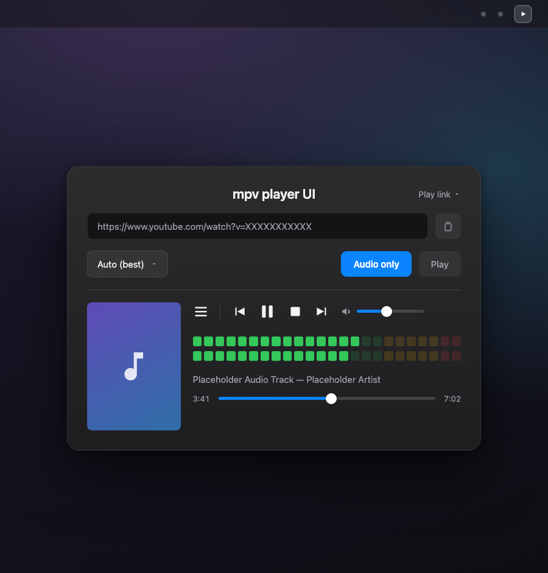

<p align="center">
  
</p>

# mpv player UI

*Read this in other languages: [Español](README.es.md)*

macOS menu bar app that plays YouTube videos (or any other site supported
by `yt-dlp`) using `mpv`.

<p align="center">
  
</p>

## Ownership & contributing

This project was created by [@jugomo](https://github.com/jugomo) and is
licensed under the [MIT License](LICENSE). Anyone is welcome to use this
software at their own risk, copy or fork it as long as the original
author is credited, and contribute back, whether that's opening a pull
request or simply suggesting improvements via an issue. No warranty is
provided.

Note: the MIT license applies to this project's own source code only.
The app uses `mpv` (GPL-licensed) and `yt-dlp` (public domain /
Unlicense) once installed on your machine; both retain their own
upstream licenses.

## Disclaimer

This project is a personal, educational experiment, with no commercial
intent and no affiliation with YouTube, Google, or their brands. It
streams content using `mpv` and `yt-dlp` at your own risk; it does not
download or redistribute videos, nor does it bypass age/region
restrictions or content-protection measures. No binaries or compiled
builds are distributed for this project, only the source code.

## Why use it

- **Play video without a browser tab open.** No Chrome/Safari running in the background, no autoplay recommendations, just `mpv` playing the video.
- **Audio-only mode, your way.** Strip the video stream for lightweight background listening, and choose in Settings whether `mpv` opens its own (auto-minimized) window or none at all — playback stays fully controllable from the app either way.
- **Play local files too.** Open one or more media files from your computer straight from the popover — the first plays immediately, the rest queue into the playlist in the order you picked them. Local audio files auto-switch to audio-only mode (with local cover art, if an image with the same name sits next to the file) regardless of the saved quality.
- **Playlist that manages itself.** Every video you play gets added, with the title fetched in the background — no manual curation needed. It chains automatically to the next item once one finishes, rows reorder via drag and drop, and the whole playlist imports/exports as a `.pl` file.
- **Uses the `mpv`/`yt-dlp` you already have installed.** The app doesn't add any new tool to your system, it just invokes them.
- **Menu-bar only, near-zero footprint.** No Dock icon, no window until you need one.
- **Keyboard media keys and Control Center work out of the box.** Skip to the next/previous playlist item without switching windows.
- **Not limited to YouTube.** Anything `yt-dlp` supports (hundreds of sites) works the same way.
- **Full playback controls right in the popover.** Previous/play-pause/stop/next, a seek bar with elapsed/remaining time, a fullscreen toggle and an always-on-top toggle (both when there's video), and a volume slider that's independent from macOS's system volume — no need to open `mpv`'s own window.
- **VU meters and cover art while playing audio-only.** A stereo level meter next to the controls, real analog needles or digital LED bars — click it to switch style — reacting to the actual audio level and to the app's own volume slider, plus the video's own thumbnail shown alongside it so the screen isn't just meters and text.
- **Menu bar icon reflects what's happening.** It spins while a video is initializing and blinks between play/pause while paused, so you can tell at a glance without opening the popover.
- **Playlist highlights what's currently playing**, in a window you can resize, dock under the popover or pop out floating — both the size and docked/floating state persist across restarts.
- **Configurable video cache and render quality**, to tune startup latency vs. playback stability, and GPU/battery usage vs. sharpness in fullscreen.
- **Spanish/English UI**, switchable from Settings without restarting the app.
- **Keeps its vendored tools honest.** The About panel quietly flags when a newer `mpv`/`yt-dlp` release is available upstream, since both ship vendored inside the app rather than being managed by a package manager at runtime.

## Requirements

To run the app: macOS 13 or later, plus [`mpv`](https://mpv.io) and
[`yt-dlp`](https://github.com/yt-dlp/yt-dlp) installed on your system
(e.g. via Homebrew: `brew install mpv yt-dlp`). The app detects them
automatically once installed.

To build it from source, you additionally need:

- [Swift toolchain](https://www.swift.org) (bundled with Xcode / Command Line Tools)
- [Homebrew](https://brew.sh) with [`mpv`](https://mpv.io) installed (`brew install mpv`), used as the local reference copy during the build
  - If your macOS version or architecture no longer has a precompiled bottle in Homebrew (e.g. Ventura on Intel), alternatives: install mpv with [MacPorts](https://www.macports.org) (`sudo port install mpv`, auto-detected), force Homebrew to build from source (`brew install mpv --build-from-source`, requires Xcode Command Line Tools), or point `build.sh` at any `mpv` binary with `MPV_BIN=/path/to/mpv ./build.sh`
- Internet access the first time you build, to download the standalone `yt-dlp` binary (cached afterwards in `.build/vendor/`)

If `mpv`/`yt-dlp` are missing on your system, the app falls back to
detecting a Homebrew install and offers to install them for you.

## Build

```sh
./build.sh
```

This generates `MpvPlayerUI.app` at the project root, built against the
`mpv` (plus its ~47 dynamic libraries) and `yt-dlp` available locally —
see `scripts/vendor_mpv.py`.

By default everything is ad-hoc signed (`CODESIGN_IDENTITY="-"`), same as
always. If you have a stable code-signing certificate (a self-signed one
created once in Keychain Access, or a paid Apple Developer Program one),
pass it to keep the Finder/file-access permissions macOS grants the app
from having to be re-granted after every rebuild — with ad-hoc signing
each rebuild looks like "a different app" to macOS since the signature
changes every time:

```sh
CODESIGN_IDENTITY="My Certificate" ./build.sh
```

## Install / run

```sh
mv MpvPlayerUI.app /Applications/
open /Applications/MpvPlayerUI.app
```

Or just `open MpvPlayerUI.app` to try it without moving it.

A ▶️ icon will appear in the menu bar (there's no Dock icon, it's a
menu-bar-only app). To have it launch automatically at login, add it in
**System Settings → General → Login Items**.

## Usage

1. Click the menu bar icon.
2. Either click the link icon next to the title (it starts collapsed) to
   reveal the URL form and paste the video URL (if you already have it
   copied, it autofills), or click the folder icon to pick one or more
   local media files instead.
3. Choose the desired quality (not shown for local files — they play as
   they are).
4. Click **Play**. `mpv` opens in a separate window with the video.

While a video loads, the menu bar icon spins; it switches back as soon as
`mpv` actually starts showing it. Once something is playing, use the
previous/play-pause/stop/next buttons in the popover (or the keyboard
media keys / Control Center) to control it, drag the seek bar to jump to a
position, and use the volume slider to adjust this app's playback only —
it never touches macOS's system volume. With the popover focused, the
← → arrow keys seek 5 seconds back/forward and the ↑ ↓ arrow keys adjust
the volume. If there's video, a fullscreen
button and an always-on-top (pin) button show up next to the playlist
button — the pin toggle is remembered across videos and app restarts, so
`mpv`'s window starts already pinned above other windows if you left it
on; in audio-only mode a VU
meter and the video's cover art show up instead, next to the title (click
the meter to switch between the digital and analog styles). The play
button turns into a pause button automatically, and the menu bar icon
blinks between play/pause while paused. When an item finishes, playback
chains automatically to the next one in the playlist.

Open **Playlist** to see, replay, reorder or export past videos; the one
currently playing is highlighted. Drag a row by its handle icon to
reorder it, or swipe a row left to reveal delete/copy-URL actions. Use
**Import…**/**Export…** at the top to move the whole playlist between
machines as a `.pl` file. The playlist window itself can be
resized by dragging its top/bottom edge, and toggled between docked
(under the popover) and floating with the button next to its title —
both the size and docked/floating state are remembered across restarts.

If `mpv`/`yt-dlp` aren't installed on your system, the popover shows a
warning with a button to install them via Homebrew. If Homebrew isn't
installed either, Terminal.app opens with the official installer
preloaded — the Homebrew installer isn't run automatically because it
requires your admin password interactively.

## Settings

Right-click the menu bar icon to open **Settings** (Help/About lives in
that same right-click menu too now). It has two tabs:

**General:**

- **Language** — Spanish/English, applied immediately without restarting.
- **Video cache** — "Fast start" (5s readahead), "Stable playback" (30s), or a custom duration via slider; controls `mpv`'s `--demuxer-readahead-secs`.
- **Video rendering** — "Performance" forces a cheap bilinear scaler (lower GPU/battery use in fullscreen) or "Quality" keeps `mpv`'s sharper default scaler.
- **Audio-only window** — toggle whether `mpv` opens its own (auto-minimized) window when playing audio-only, or no window at all; either way, playback stays fully controllable from the app's own buttons, seek bar and VU meter.
- **Close windows on play** — when enabled (the default), the main popover and the playlist window close automatically once playback starts. Turn it off to keep the popover open even after it loses focus (e.g. while you interact with `mpv`'s own window) — click the menu bar icon again to close it manually.

**Log Viewer** — shows the tail of `mpv`'s log right in the app, with
buttons to reload it, export it to a `.txt` file, or clear it. See
[Playback log](#playback-log) below for where the underlying file lives.

The **About** window (also in the right-click menu) additionally shows a
notice whenever a newer `mpv` or `yt-dlp` release is available upstream —
since both are vendored into the app bundle, applying it means rebuilding
with `build.sh`, not an in-app update.

## Project structure

- `Sources/MpvPlayerUI/DependencyChecker.swift` — detects `brew`, `mpv` and `yt-dlp` installed on the system
- `Sources/MpvPlayerUI/HomebrewInstaller.swift` — installs packages with `brew install` / opens Terminal to install Homebrew
- `scripts/vendor_mpv.py` — copies `mpv` and its dylib closure from a local install into the app bundle and rewrites their linked paths to `@rpath`, called from `build.sh`
- `Sources/MpvPlayerUI/MPVLauncher.swift` — maps quality → `yt-dlp` format and launches `mpv`; talks to it over its JSON IPC socket (`MPVIPCClient.swift`) to observe pause state/title/time position and detect the moment playback actually starts
- `Sources/MpvPlayerUI/UpdateChecker.swift` — background, once-a-day, cached check of the bundled `mpv`/`yt-dlp` versions against their latest upstream release, surfaced in `AboutView`
- `Sources/MpvPlayerUI/PlayerView.swift` / `PlayerViewModel.swift` — popover UI and playback state (loading, paused, current item, seek position, volume, VU meter levels), including opening local files and auto-advancing to the next playlist item
- `Sources/MpvPlayerUI/VUMeterView.swift` / `VUMeterSettings.swift` — the digital/analog stereo VU meter shown during audio-only playback, and its persisted style preference; levels come from `mpv`'s `astats` audio filter, read over IPC
- `Sources/MpvPlayerUI/CacheSettings.swift` / `RenderSettings.swift` / `PlaybackWindowSettings.swift` — persisted Settings state (video cache, render quality, audio-only window behavior, whether the popover/playlist window close on play, and the playlist window's docked/floating state and size), shared between `SettingsView` and `MPVLauncher`/`AppDelegate`
- `Sources/MpvPlayerUI/PlaylistItem.swift` / `PlaylistStore.swift` — playlist item model (local-file vs. URL, quality, fetched title/description) and its JSON persistence/import/export to a `.pl` file
- `Sources/MpvPlayerUI/YtDlpMetadataFetcher.swift` — fetches a video's description on demand via `yt-dlp` (mpv's IPC only exposes the title)
- `Sources/MpvPlayerUI/PlaylistView.swift` — playlist window: highlights the currently playing item, drag-to-reorder, swipe actions, docked/floating toggle
- `Sources/MpvPlayerUI/SettingsView.swift` — General tab (language, cache, render, audio-only window) and Log Viewer tab
- `Sources/MpvPlayerUI/LogViewerView.swift` — in-app viewer for `mpv`'s log, with reload/export/clear
- `Sources/MpvPlayerUI/AboutView.swift` — About/Help window, including the vendored-tool update notice
- `Sources/MpvPlayerUI/TitleToastView.swift` — the "now playing" toast shown outside `mpv`'s window
- `Sources/MpvPlayerUI/Localization.swift` — hand-rolled ES/EN string table, switchable at runtime from Settings
- `Sources/MpvPlayerUI/AppDelegate.swift` / `App.swift` — menu bar icon (incl. the loading/paused animations) and app startup
- `Resources/Info.plist` — bundle metadata (`LSUIElement` to keep it menu-bar-only)
- `build.sh` — builds and packages `MpvPlayerUI.app`

## Playback log

`mpv` logs are saved to `~/Library/Logs/MpvPlayerUI/mpv.log`, useful
if a video fails to start — or open it straight from Settings → Log
Viewer, which can also export or clear it.
