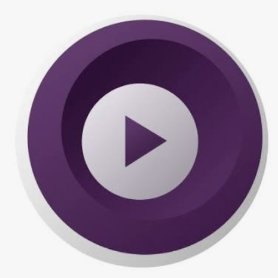

<p align="center">
  
</p>

# mpv YouTube Player

*Read this in other languages: [Español](README.es.md)*

macOS menu bar app that plays YouTube videos (or any other site supported
by `yt-dlp`) using `mpv`.

## Why use it

- **Play video without a browser tab open.** No Chrome/Safari running in the background, no autoplay recommendations, no ads — just `mpv` playing the video.
- **Audio-only mode for music videos.** Strips the video stream entirely for lightweight background listening.
- **Playlist built automatically.** Every video you play gets added to a playlist, with the title fetched in the background — no manual curation needed.
- **Menu-bar only, near-zero footprint.** No Dock icon, no window until you need one, and dependencies (`mpv`, `yt-dlp`, Homebrew) are detected and installed for you.
- **Keyboard media keys and Control Center work out of the box.** Skip to the next/previous playlist item without switching windows.
- **Not limited to YouTube.** Anything `yt-dlp` supports (hundreds of sites) works the same way.

## Requirements

- macOS 13 or later
- [Swift toolchain](https://www.swift.org) (bundled with Xcode / Command Line Tools) to build
- [Homebrew](https://brew.sh), [`mpv`](https://mpv.io) and [`yt-dlp`](https://github.com/yt-dlp/yt-dlp) — the app detects them and offers to install them if missing

## Build

```sh
./build.sh
```

This generates `MpvYoutubePlayer.app` at the project root, ad-hoc signed.

## Install / run

```sh
mv MpvYoutubePlayer.app /Applications/
open /Applications/MpvYoutubePlayer.app
```

Or just `open MpvYoutubePlayer.app` to try it without moving it.

A ▶️ icon will appear in the menu bar (there's no Dock icon, it's a
menu-bar-only app). To have it launch automatically at login, add it in
**System Settings → General → Login Items**.

## Usage

1. Click the menu bar icon.
2. Paste the YouTube video URL (if you already have it copied, it
   autofills).
3. Choose the desired quality.
4. Click **Play**. `mpv` opens in a separate window with the video.

If `mpv` or `yt-dlp` aren't installed, the popover shows a warning with a
button to install them via Homebrew. If Homebrew isn't installed either,
Terminal.app opens with the official installer preloaded — the Homebrew
installer isn't run automatically because it requires your admin password
interactively.

## Project structure

- `Sources/MpvYoutubePlayer/DependencyChecker.swift` — detects `brew`, `mpv` and `yt-dlp`
- `Sources/MpvYoutubePlayer/HomebrewInstaller.swift` — installs packages with `brew install` / opens Terminal to install Homebrew
- `Sources/MpvYoutubePlayer/MPVLauncher.swift` — maps quality → `yt-dlp` format and launches `mpv`
- `Sources/MpvYoutubePlayer/PlayerView.swift` / `PlayerViewModel.swift` — popover UI
- `Sources/MpvYoutubePlayer/AppDelegate.swift` / `main.swift` — menu bar icon and app startup
- `Resources/Info.plist` — bundle metadata (`LSUIElement` to keep it menu-bar-only)
- `build.sh` — builds and packages `MpvYoutubePlayer.app`

## Playback log

`mpv` logs are saved to `~/Library/Logs/MpvYoutubePlayer/mpv.log`, useful
if a video fails to start.
